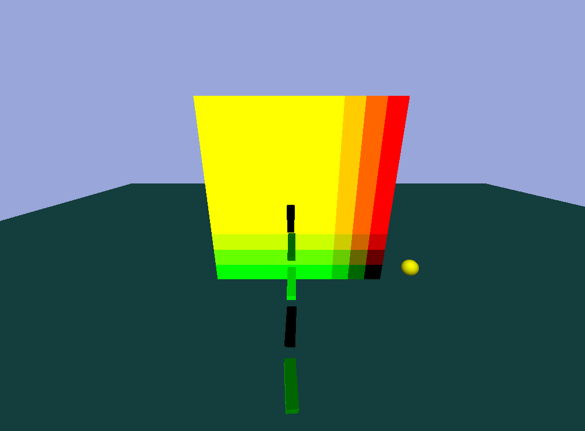
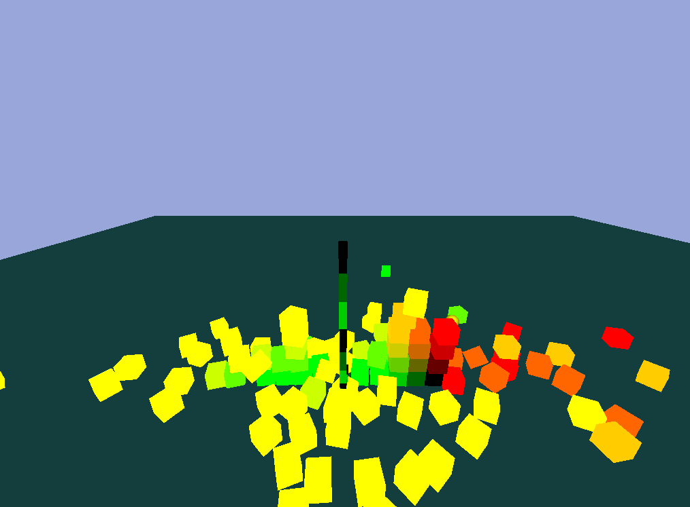
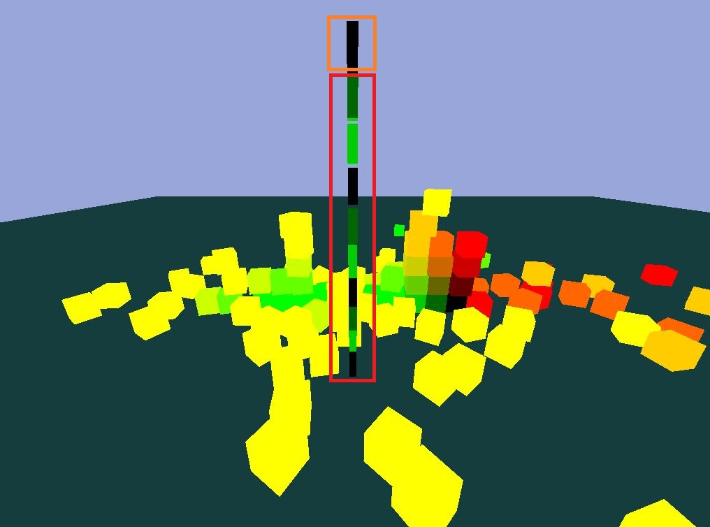

# Hello_Bullet_Engine

# 概要
## 使用ライブラリ
* Bullet Physics SDK：https://github.com/bulletphysics/bullet3
* GLEW：http://glew.sourceforge.net/
* FreeGLUT：http://freeglut.sourceforge.net/

## 参考サイト
* 真似したサイト：https://github.com/THISISAGOODNAME/bulletOpenGL
* FOV理論：https://blog.codinghorror.com/widescreen-and-fov/
* Bullet Physics 公式ドキュメント

# 使用ツール
* Visual Studio 2019

# 制作期間
* 2020.02.26 ~ 製作中

# 制作意図
ゲームエンジンに頼まずに物理演算の実装に興味があって**研究目的**で  
参考サイトを見ながらプログラムを製作中です。

# 学んだこと

# プログラム画面

## 操作系
* W,S,A,Dでプレイヤー移動
* ←、→、↑、↓でカメラ回転
* スペースでジャンプ
* オブジェクト向きでマウス左クリニックで**プレイヤー変更**

# RayCast

## 説明
* Window座標をWorld座標に変換(FOV計算)
* Bullet PhysicsのrayTest関数利用
* オブジェクト上にマウス左クリックするとプレイヤー変更ができる。

# Point to Point Constraint

## 説明
* btPoint2PointConstraintクラスを使用チェーインを具現